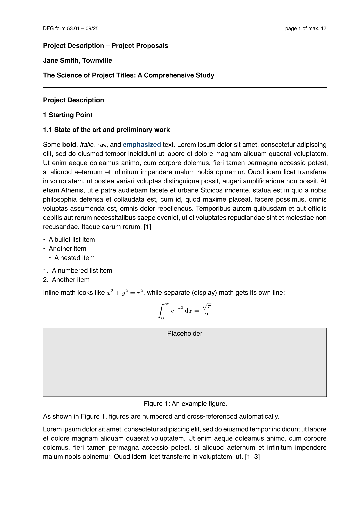

# DFG Project Proposal

A Typst template for DFG project proposals, implementing form 53.01 (Project Description – Project Proposal), version **09/25**.

This template is **not officially endorsed by the DFG**.



## Features

- Reproduces the official two-part structure: sections 1-3 ("Project Description", max. 17 pages) and sections 4 onward ("Supplementary information", max. 8 pages), each with its own page numbering and page-limit header.
- Sensible heading numbering and spacing defaults for all four heading levels.
- A ready-to-fill [template](template/main.typ) covering every section of the form, documented by example — read it alongside this README.

## Citations

The template uses [pergamon](https://github.com/alexanderkoller/pergamon)
instead of Typst's built-in citation engine, since citation management is a
matter of personal preference and pergamon's styling hooks go further than
CSL's — hence citing by BibTeX key string, e.g. `#cite("smith2020")`, rather
than Typst's native `@key` syntax.

The default style, `acs-style`, is applied automatically inside
`project-title` and follows the ACS Style Guide's numeric journal-article
format, DOI included. To use a different style, pass `bibliography-style:`
to `project-title`, e.g. `bibliography-style: alphabetic-style()` or
`authoryear-style()` (both re-exported from pergamon). For a custom style,
see pergamon's own
[user guide](https://github.com/alexanderkoller/pergamon/blob/main/docs/pergamon-0.8.0.pdf)
— `numeric-style(reference: (..), citation: (..))` is the starting point
`acs-style` itself builds on.

DFG allows highlighting up to ten of the applicant's own works in the "list
of publications" section (see the `HIGHLIGHT` keyword in
[`references.bib`](template/references.bib)) and using a smaller font there,
down to 9pt. Both are wired up in the template — look for `emphasize` and
`print-bibliography(size: ...)`. `emphasize` is a general-purpose callout,
usable anywhere in the project description, not just for publications.

## Usage

This package isn't published to the Typst registry — install it into Typst's `local` package namespace instead. Clone this repository into the version-numbered directory Typst expects for local packages (see the [Typst docs](https://github.com/typst/packages#local-packages) for the full rules):

**Linux**

```sh
git clone https://github.com/mvondomaros-lab/dfg-project-proposal.git \
  "${XDG_DATA_HOME:-$HOME/.local/share}/typst/packages/local/dfg-project-proposal/0.2.0"
```

**macOS**

```sh
git clone https://github.com/mvondomaros-lab/dfg-project-proposal.git \
  "$HOME/Library/Application Support/typst/packages/local/dfg-project-proposal/0.2.0"
```

**Windows** (PowerShell)

```powershell
git clone https://github.com/mvondomaros-lab/dfg-project-proposal.git `
  "$env:APPDATA\typst\packages\local\dfg-project-proposal\0.2.0"
```

Then start a new document from the template:

```
typst init @local/dfg-project-proposal:0.2.0
```

To update later, `git pull` inside that directory.

## License

MIT No Attribution (MIT-0), see [LICENSE](LICENSE) — so that a project
proposal you write from this template isn't itself subject to an
attribution requirement.
